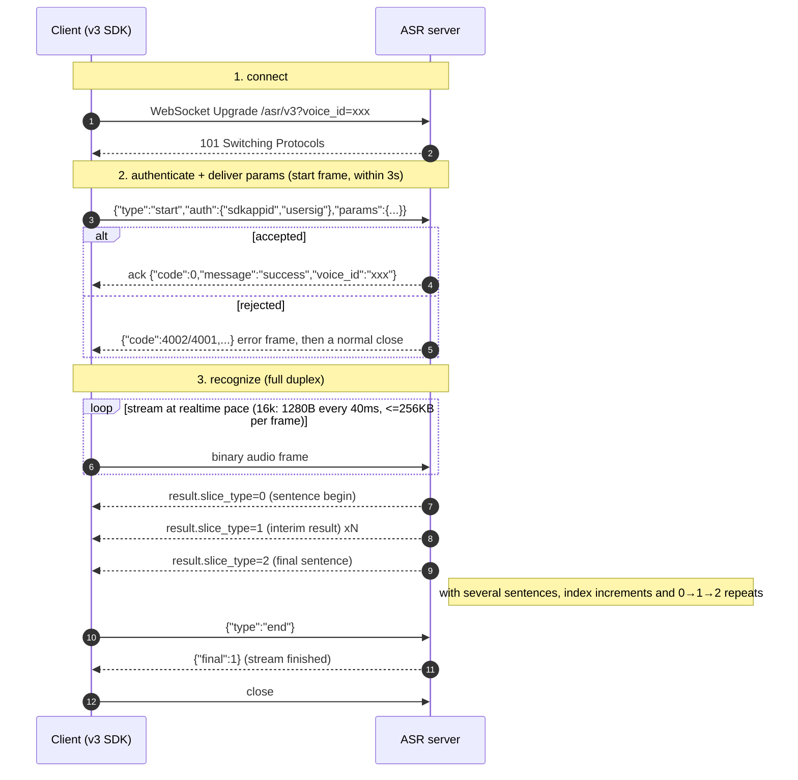
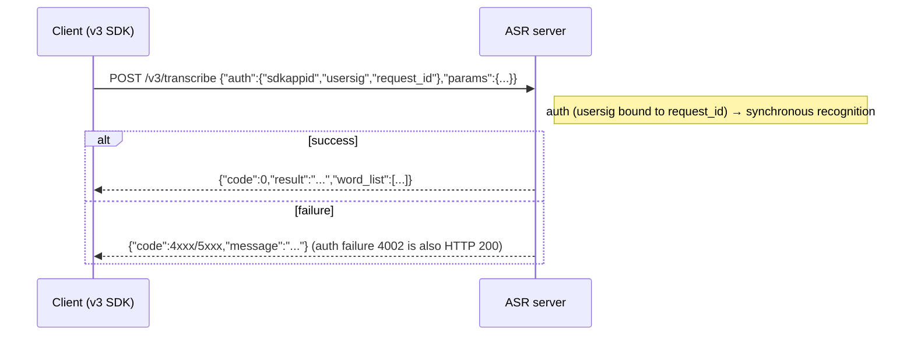
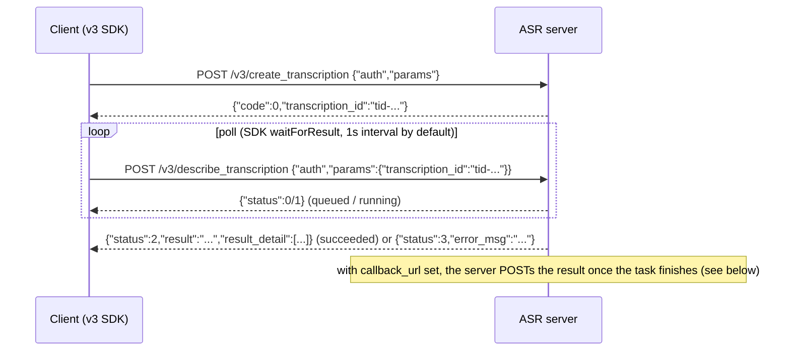

# TRTC-ASR Node.js SDK

Node.js SDK for Tencent TRTC speech recognition (ASR): realtime recognition (WebSocket), one-shot sentence recognition (HTTP) and asynchronous audio file recognition (HTTP).

This SDK targets the **v3 protocol**: only `SdkAppID` + `SecretKey` are required (no Tencent Cloud AppID), requests use separate `auth` / `params` blocks, everything is snake_case, and responses are flat with numeric codes. The v3 client lives in the `v3` namespace (`import { v3 } from "trtc-asr"`).

> [English](./README.en.md) | [中文](./README.md)
>
> SDKs: [Go](https://github.com/Tencent-RTC/trtc-asr-sdk-go) | [Python](https://github.com/Tencent-RTC/trtc-asr-sdk-python) | [Java](https://github.com/Tencent-RTC/trtc-asr-sdk-java) | [Rust](https://github.com/Tencent-RTC/trtc-asr-sdk-rust) | [C++](https://github.com/Tencent-RTC/trtc-asr-sdk-cpp)
>
> The **legacy v2 / v1 protocol** (and its clients) is documented in [docs/v2_protocol.md](./docs/v2_protocol.md). Those clients stay fully supported; existing users do not need to change anything.

## Prerequisites

Two credentials are needed: `SdkAppID` and `SecretKey` (on v3 `SdkAppID` is the only customer dimension — the Tencent Cloud `AppID` is **no longer needed**). The domestic and international sites use different account systems — follow the official quick start for your site to register, create an application and activate the service:

- **China site**: [Quick Start](https://xai.cloud-rtc.com/#gettingStarted) — register a Tencent Cloud account and complete real-name verification → create an application in the [TRTC console](https://console.cloud.tencent.com/trtc/app) → activate "AI Speech Recognition" (free trial available)
- **International site**: [Quick Start](https://xai-intl.cloud-rtc.com/#gettingStarted) — register at [trtc.io](https://www.trtc.io) (a Tencentcloud account is created automatically, no real-name verification) → create an application at [console.trtc.io](https://console.trtc.io) → activate "AI Speech Recognition" (RTC Engine Lite or above only; Free Trial is not supported)

## Protocol (v3)

### Endpoints

| Mode | Path |
|------|------|
| Realtime (WebSocket) | `wss://{host}/asr/v3?voice_id=<voice_id>` |
| Sentence (one-shot) | `POST https://{host}/v3/transcribe` |
| Audio file (async) | `POST https://{host}/v3/create_transcription` |
| Task query | `POST https://{host}/v3/describe_transcription` |

`{host}` is `asr.cloud-rtc.com` (China) or `asr-intl.cloud-rtc.com` (international, `credential.setSite(SITE_INTL)`).

### Authentication and parameters (auth / params blocks)

v3 splits a request into two orthogonal blocks, all snake_case:

- `auth`: identity and signature, consumed by the gateway authentication layer — **realtime and HTTP carry different fields, see below**.
- `params`: recognition options (engine, VAD, hotwords, filters, …), named like the v2 realtime query parameters.

Both blocks share the same signature rules:

- Without `credential.setUserSig()`, the SDK derives the signature locally from `SDKAppID + SecretKey`, valid for **86400 seconds**, and regenerates it for every connection / request — long-running services need no extra care.
- Once `credential.setUserSig(sig)` sets a fixed signature, the SDK **neither generates nor refreshes it**. The server verifies it against the current identifier (`voice_id` for realtime, `request_id` for HTTP), so the signature must be issued with that same identifier; fixed-signature setups (e.g. a browser client receiving a signature from your backend) must handle expiry and identifier alignment themselves.
- The signature is bound to the site: `credential.setSite(SITE_INTL)` selects both the host and the verification cluster — do not mix China-site and international-site credentials.
- `SecretKey` never leaves your process; the signature is only used for server-side verification.

#### Realtime (streaming) authentication

One WebSocket connection is one stream; `voice_id` is both the stream identity and the signature identifier (it travels in the URL and in `params`, so the `auth` block does not repeat it).

| Field | Type | Required | Notes |
|-------|------|----------|-------|
| `sdkappid` | string | yes | TRTC application ID, taken from the credential and filled in by the SDK |
| `usersig` | string | yes | TRTC signature; identifier = the current `voice_id` (the SDK signs with that value) |

- **There is no `request_id` in realtime**: it belongs to the one-request-one-transaction HTTP interfaces (below).
- `voice_id` appears both in the URL (`?voice_id=`) and in `params.voice_id` (keep them equal, or omit the param); max 128 characters. The SDK generates a UUID by default and `setVoiceId` overrides it; a conflict with a live stream returns `4001`.
- One stream carries one signature, issued per connection — a reconnect signs again, so there is no expiry to manage yourself.

Within **3 seconds** of the WebSocket handshake, send one start frame:

```json
{
  "type": "start",
  "auth": {"sdkappid": "1400000001", "usersig": "eJw..."},
  "params": {"engine_model_type": "bigmodel", "language": "zh", "voice_format": 1, "needvad": 1}
}
```

On success the server replies `{"code":0,"message":"success","voice_id":"..."}`. After that, audio goes out as binary frames and the session ends with `{"type":"end"}`. The SDK's `start()` **waits synchronously for this ack**, so authentication and parameter errors are returned from `start()` itself.

#### HTTP authentication

Every HTTP request is an independent transaction; `request_id` is both the per-request ID and the signature identifier (the caller never has to generate one).

| Field | Type | Required | Notes |
|-------|------|----------|-------|
| `sdkappid` | string | yes | TRTC application ID, taken from the credential and filled in by the SDK |
| `usersig` | string | yes | TRTC signature; identifier = this request's `request_id` (the SDK signs with that value) |
| `request_id` | string | yes | Per-request ID, generated by the SDK (UUID) on every request; echoed in the response and carried back by `callback_url`, which makes it the key for reconciliation and troubleshooting (not customizable) |

The body is the symmetric `{"auth":{...},"params":{...}}` envelope and the response is flat (no `Response` wrapper):

```json
{"code": 0, "message": "success", "request_id": "req-uuid", "result": "transcript", "audio_duration": 1234}
```

> **Note**: an HTTP authentication failure arrives as **HTTP 200** with `{"code":4002}`. Always judge the outcome by the `code` in the body (the SDK does this: any non-zero code becomes an error carrying that code).

### Realtime flow (connect → authenticate → recognize)



> Mapping to the SDK: `Start()` = steps 1+2 (waits for the ack, fails fast); `Write()` = step 3 uplink; downlink frames reach you through the listener (`OnSentenceBegin` / `OnRecognitionResultChange` / `OnSentenceEnd` / `OnRecognitionComplete`); `Stop()` sends `end` and waits for `final:1`. Idle guard: the server closes with `4008` after 15s without audio.

### Start-frame parameters

`needvad`, `vad_silence_time`, `vad_level`, `input_sample_rate`, `convert_num_mode`, `filter_empty_result` and `noise_threshold` are tri-state: omitting them keeps the server default, while an explicit `0` is meaningful and is honored on v3 (the v2 query transport silently dropped explicit zeros).

| Field | Type | Default | Description |
|-------|------|---------|-------------|
| `voice_id` | string | from URL | Stream ID (<=128 chars); same as the URL or omitted |
| `engine_model_type` | string | **required** | Engine model; no default, must be provided. The examples pass `bigmodel` (recommended, with `language`) |
| `language` | string | empty | Language hint (`zh`, `en`, `ja`, …); empty = auto detect. `bigmodel` is best used with an explicit value (e.g. `zh`) |
| `voice_format` | int | `1` | Audio format: `1`pcm/`4`speex/`6`silk/`8`mp3/`10`opus/`11`ogg/`12`wav/`14`m4a/`16`aac |
| `input_sample_rate` | int | — | Only `8000`: declare 8k PCM input for a 16k engine |
| `needvad` | int | engine default | `0` off / `1` on |
| `vad_silence_time` | int | `800` | Sentence-final silence (ms); 240–2000 when `needvad=1` |
| `vad_level` | int | `1` | VAD profile: `0` high recall / `1` far-field filtering |
| `noise_threshold` | float | — | Noise threshold `0`–`4`; overrides `vad_level` when set |
| `max_speak_time` | int | `60000` | Forced sentence split (ms); 5000–90000 |
| `filter_dirty` | int | `0` | Profanity: `0` off / `1` filter / `2` replace with * |
| `filter_modal` | int | `0` | Modal particles: `0` off / `1` partial / `2` strict |
| `filter_punc` | int | `0` | Final punctuation: `0` off / `1` filter |
| `filter_empty_result` | int | `1` | Empty results: `0` deliver / `1` skip |
| `convert_num_mode` | int | `1` | Number conversion: `0` off / `1` smart / `3` math |
| `word_info` | int | `0` | Word timings: `0` off / `1` on / `2` with punctuation / `100` caption |
| `word_with_space` | int | `0` | Space-separated English words |
| `hotword_id` | string | empty | Hotword table ID (per SdkAppID) |
| `hotword_list` | string | empty | Inline hotwords: `word\|weight` comma-separated; word <=30 chars, weight 1–11 or 100 |
| `speaker_diarization` | int | `0` | Diarization: `0` off / `1` anonymous clustering / `3` voiceprint roles |
| `speaker_number` | int | `0` | Speaker count hint; `0` = auto detect |
| `voiceprint_ids` | []string | empty | Enrolled voiceprint IDs (only `speaker_diarization=3`) |
| `speaker_roles` | []object | empty | Temporary voiceprints: `[{"audio_url":"...","role_name":"..."}]` (only mode 3); `role_name` is echoed in results |
| `context` | object | empty | Recognition context: `{"text":"background","terms":["term"],"general":[{"key":"domain","value":"Meeting"}]}` |

> How `context` is consumed depends on the engine: LLM-class engines can use `text` / `terms` / `general`, while traditional engines degrade `terms` to hotwords and ignore the rest. With `speaker_diarization=1/3` the server forces VAD on and adjusts `word_info`.

### Realtime response

The downlink shape is identical to v2 (`code` / `message` / `voice_id` / `message_id` / `result` / `final`):

| Field | Type | Description |
|-------|------|-------------|
| `code` / `message` | Integer / String | Status code and text; `0` means success |
| `voice_id` / `message_id` | String | Stream ID / message ID |
| `final` | Integer | `1` marks the end-of-stream frame |
| `result.slice_type` | Integer | `0` sentence begin, `1` interim, `2` final sentence |
| `result.index` | Integer | Sentence index |
| `result.start_time` / `end_time` | Integer | Result time range (ms) |
| `result.voice_text_str` | String | Result text |
| `result.word_size` / `word_list` | Integer / Array | Word (character) timings, requires `word_info != 0` |
| `result.speaker_segments` | Array | Speaker segments, returned when diarization is on |
| `result.language` | String | Detected language (when the engine reports it) |
| `result.finish_silence_ms` | Integer | Trailing silence that triggered the split (ms) |
| `result.last_token_runtime_ms` | Integer | Server-side decode time of the last token (ms) |

### Sentence recognition /v3/transcribe



`params`:

| Field | Type | Required | Description |
|-------|------|----------|-------------|
| `engine_model_type` | string | yes | Engine model, required; the examples pass `bigmodel` (recommended, with `language`) |
| `source_type` | int | yes | `0` URL / `1` local data (base64) |
| `voice_format` | string | yes | `wav`, `pcm`, `ogg-opus`, `mp3`, `m4a` |
| `url` | string | conditional | Audio URL (required when `source_type=0`) |
| `data` | string | conditional | Base64 audio (required when `source_type=1`) |
| `data_len` | int | conditional | Original audio length (required when `source_type=1`) |
| `word_info` | int | no | `0` off / `1` on / `2` with punctuation |
| `filter_dirty` | int | no | Dirty words: `0` off / `1` filter / `2` replace with `*` |
| `filter_modal` | int | no | Filler words: `0` off / `1` partial / `2` strict |
| `filter_punc` | int | no | Punctuation: `0` keep / `1` strip |
| `convert_num_mode` | int | no | `0` off / `1` smart / `3` math |
| `hotword_id` | string | no | Hotword list ID |
| `customization_id` | string | no | Custom language model ID |
| `hotword_list` | string | no | Inline hotword list |
| `input_sample_rate` | int | no | PCM input sample rate (only 8000) |
| `needvad` | int | no | Tri-state; omitted means server default, `0` off / `1` on |
| `vad_silence_time` | int | no | Tri-state; omitted means server default (800), split silence in ms |
| `language` | string | no | Language hint; empty = auto detect |
| `speaker_diarization` | int | no | Diarization: `0` off / `1` cluster / `3` voiceprint roles |
| `speaker_number` | int | no | Speaker count hint; `0` = auto |
| `context` | object | no | Recognition context (same shape as realtime) |

**Limits**: audio <= 60s, file <= 3MB.

Response (`TranscribeResponse`):

| Field | Type | Description |
|-------|------|-------------|
| `code` / `message` / `request_id` | int / string / string | Status code / message / request ID |
| `result` | string | Recognized text |
| `audio_duration` | int | Audio duration (ms) |
| `language` / `language_b47` | string | Detected language |
| `word_size` / `word_list` | int / array | Word-level result; `word_list[]` carries `word` / `start_time` / `end_time` (ms) |

### Audio file recognition /v3/create_transcription

Asynchronous: creating a task returns a `transcription_id` (valid for 24 hours), which you then poll with the task query endpoint.



`params`:

| Field | Type | Required | Description |
|-------|------|----------|-------------|
| `engine_model_type` | string | yes | Engine model, required; the examples pass `bigmodel` (recommended, with `language`) |
| `channel_num` | int | yes | Channels: `1` mono; `2` stereo (splits by `channel_id`; do not combine with diarization) |
| `res_text_format` | int | yes | `0` plain / `1` with word timings / `2` with punctuation timings |
| `source_type` | int | yes | `0` URL / `1` local data (base64) |
| `url` | string | conditional | Audio URL (`source_type=0`, <=12h, <=1GB) |
| `data` / `data_len` | string / int | conditional | Base64 audio and original length (`source_type=1`, <=5MB) |
| `audio_urls` | array | no | Distributed recording: `[{"index":0,"url":"...","label":"..."}]` |
| `callback_url` | string | no | Result callback URL (POSTed when the task finishes) |
| `speaker_diarization` | int | no | Diarization: `0` off / `1` cluster / `3` voiceprint roles |
| `speaker_number` | int | no | Speaker count hint |
| `voiceprint_ids` | array | no | Enrolled voiceprint IDs (mode 3 only) |
| `speaker_roles` | array | no | Temporary voiceprints `[{"audio_url","role_name"}]` (mode 3 only) |
| `hotword_id` | string | no | Hotword list ID |
| `customization_id` | string | no | Custom language model ID |
| `hotword_list` | string | no | Inline hotword list |
| `keyword_lib_id_list` | array | no | Keyword library ID list |
| `replace_text_id` | string | no | Replacement table ID |
| `convert_num_mode` | int | no | Number conversion |
| `filter_dirty` / `filter_punc` / `filter_modal` | int | no | Filters |
| `sentence_max_length` | int | no | Maximum sentence length |
| `extra` | string | no | Engine-specific extra string |
| `vad_silence_ms` | int | no | Split silence threshold (ms) |
| `vad_level` | int | no | VAD profile: `0` high recall / `1` far-field |
| `noise_threshold` | float | no | Noise threshold `0`~`4` (`0` is valid; use `undefined` to mean "unset") |
| `language` | string | no | Language hint; empty = auto detect |
| `context` | object | no | Recognition context (same shape as realtime) |

Response: `{"code":0,"message":"success","request_id":"...","transcription_id":"..."}`.

`callback_url` callback (`application/x-www-form-urlencoded`, snake_case fields):

| Field | Description |
|-------|-------------|
| `code` / `message` | `0` success / failure reason |
| `request_id` | The `auth.request_id` value from creation |
| `transcription_id` | Task ID |
| `text` / `audio_duration` | On success: full text / duration (seconds) |
| `audio_url` | Audio URL (when present and allowed to be returned) |
| `result_detail` | JSON string; sentence shape identical to the task query response |

### Task query /v3/describe_transcription

`params` has a single field: `transcription_id` (the ID returned at creation; not interchangeable with the v1 `RecTaskId`).

Response (`TranscriptionStatus`):

| Field | Type | Description |
|-------|------|-------------|
| `code` / `message` / `request_id` | — | Status code / message / request ID |
| `transcription_id` | string | Task ID |
| `status` / `status_str` | int / string | `0` queued / `1` running / `2` succeeded / `3` failed |
| `progress` | int | Progress (0-100) |
| `audio_duration` | float | Audio duration (seconds) |
| `result` | string | Full recognized text |
| `result_detail` | array | Per-sentence results (see below) |
| `error_msg` | string | Failure reason |

`result_detail[]` (`SentenceDetail`):

| Field | Type | Description |
|-------|------|-------------|
| `final_sentence` / `slice_sentence` / `written_text` | string | Final sentence / sliced sentence / written text |
| `start_ms` / `end_ms` | int | Sentence start/end (ms) |
| `words_num` / `words` | int / array | Word-level result; `words[]` carries `word` / `start_time` / `end_time` |
| `speech_speed` | float | Speaking rate |
| `speaker_id` | int | Speaker number (returned with diarization on) |
| `channel_id` | int | Stereo channel: 1 = left, 2 = right |
| `speaker_role_name` | string | Role name (mode 3, when a voiceprint matches) |
| `silence_time` | int | Leading silence (ms) |
| `language` / `language_b47` | string | Detected language of the sentence |

### Error codes

| code | Meaning | Typical trigger |
|------|---------|-----------------|
| `4000` | Audio sent too fast | At most 3s of audio per 1s wall-clock |
| `4001` | Invalid parameter | params validation failed / `voice_id` conflict |
| `4002` | Authentication failed | missing `auth` / bad `usersig` / querying another account's task |
| `4003` | Service not activated | scheduling refused |
| `4006` | Concurrency limit | account concurrency or connection limit |
| `4007` | Audio decode failed | audio does not match `voice_format` |
| `4008` | Timeout | no audio for 15s / start frame not sent within 3s |
| `4010` | Unknown text message | invalid start frame JSON or `type` other than `start` |
| `5000`/`5001`/`5002` | Server error | no worker available / scheduling failed; retryable |

HTTP status vs. `code`: invalid parameter `400`, authentication failure **`200`**, concurrency `429`, body too large `413`, scheduling failure `503` — **always trust the `code` in the body**.

### Speaker diarization (realtime)

With `speaker_diarization` on, speaker attribution comes through two entries:

- `result.speaker_segments[]`: **the recommended entry.** A single `result` may span several speakers, so sentence-level attribution is inherently ambiguous — the protocol therefore returns segments split by speaker. `len(speaker_segments) == 1` means a single-speaker sentence.
- `result.word_list[].speaker_id`: character-level attribution; requires `word_info != 0` as well.

`speaker_id` semantics: valid within a session, numbered from `1`, `-1` means unknown, `0` is reserved.

`speaker_segments[]` fields:

| Field | Type | Description |
|-------|------|-------------|
| `speaker_id` | Integer | Speaker number |
| `speaker_name` | String | Role name; only returned with `speaker_diarization=3` when a registered voiceprint matches, equal to the request-side `RoleName` |
| `start_time` / `end_time` | Integer | Segment time range (ms) |
| `text` | String | Segment text |
| `word_start` / `word_end` | Integer | Inclusive indices into `word_list`, i.e. `word_list[word_start:word_end+1]`; not returned when `word_info=0` |
| `stable_flag` | Integer | Whether the segment is stable: `1` stable, `0` not stable |

Node.js usage:

```ts
import { v3 } from "trtc-asr";

const recognizer = new v3.SpeechRecognizer(credential, "bigmodel", listener);
recognizer.setLanguage("zh");                                     // recommended for bigmodel
recognizer.setWordInfo(1);                                        // needed for character-level speaker ids
recognizer.setSpeakerDiarization(v3.SPEAKER_DIARIZATION_CLUSTER); // 1: anonymous clustering

// Voiceprint role authentication (returns role names):
// recognizer.setSpeakerDiarization(v3.SPEAKER_DIARIZATION_VOICEPRINT); // 3
// recognizer.setSpeakerRoles([
//   { role_name: "teacher", audio_url: "https://example.com/teacher.wav" },
// ]);
// recognizer.setVoiceprintIds(["vp-1"]); // enrolled voiceprints
// recognizer.setSpeakerNumber(2);        // 0 = auto detect; works for both modes

// In the callback:
const listener: v3.SpeechRecognitionListener = {
  onSentenceEnd(resp) {
    for (const seg of resp.result?.speaker_segments ?? []) {
      const name = seg.speaker_name || `spk${seg.speaker_id}`;
      console.log(`[${name}] ${seg.text}`);
    }
  },
};
```

### VAD tuning (noise_threshold / vad_level)

| Method | Value | Description |
|--------|-------|-------------|
| `setVadLevel(level)` | `0` / `1` | `0` high recall, `1` far-field filtering (server default) |
| `setNoiseThreshold(v)` | `0.0` - `4.0` | Noise suppression fine-tuning; higher means stronger suppression and lower recall; overrides the `vad_level` profile |
| `setVadSilenceTime(ms)` | 240 - 2000 | Silence threshold for sentence splitting |

Both are tri-state: **only an explicit setter call is sent on the wire**, so an explicit `0` is distinguishable from "not configured" (the server default for `vad_level` is `1`). Out-of-range values fail locally in `start()` instead of wasting a connection.

## Installation

```bash
npm install trtc-asr
```

**Requires**: Node.js >= 16

## Quick start

### Realtime recognition

```typescript
import { v3 } from "trtc-asr";
import * as fs from "fs";

// Implement only the events you care about; the listener shape is the same as
// v2 because the downlink frames are identical.
const listener = {
  onSentenceEnd(resp) {
    console.log(`Sentence end: ${resp.result?.voice_text_str}`);
  },
  onFail(resp, error) {
    console.error(`Failed: ${error}`); // code is the server code
  },
};

async function main() {
  // First argument is the SdkAppID; v3 needs no Tencent Cloud AppID.
  const credential = v3.newCredential(1400000000, "your-sdk-secret-key");
  // credential.setSite(SITE_INTL);  // international site

  const recognizer = new v3.SpeechRecognizer(credential, "bigmodel", listener);
  recognizer.setLanguage("zh"); // bigmodel works best with an explicit language

  // start() waits synchronously for the server ack; auth/param errors throw here.
  await recognizer.start();

  const fileData = fs.readFileSync("audio.pcm");
  const SLICE_SIZE = 6400; // 200ms of 16kHz 16bit mono PCM
  for (let offset = 0; offset < fileData.length; offset += SLICE_SIZE) {
    await recognizer.write(Buffer.from(fileData.subarray(offset, offset + SLICE_SIZE)));
    await new Promise((r) => setTimeout(r, 200)); // realtime pacing
  }

  await recognizer.stop(); // sends {"type":"end"} and waits for final
}

main().catch(console.error);
```

### Sentence recognition

```typescript
import { v3 } from "trtc-asr";
import * as fs from "fs";

const credential = v3.newCredential(1400000000, "your-sdk-secret-key");
const recognizer = new v3.SentenceRecognizer(credential);

const data = fs.readFileSync("audio.pcm");
const result = await recognizer.recognizeDataWithOptions(Buffer.from(data), {
  engine_model_type: "bigmodel",
  voice_format: "pcm",
  source_type: 1,
  language: "zh",
});

console.log(`Result: ${result.result}`);
console.log(`Duration: ${result.audio_duration} ms`);
```

### Audio file recognition

```typescript
import { v3 } from "trtc-asr";

const credential = v3.newCredential(1400000000, "your-sdk-secret-key");
const recognizer = new v3.FileRecognizer(credential);

const taskId = await recognizer.createTask({
  engine_model_type: "bigmodel",
  channel_num: 1,
  res_text_format: 1,
  source_type: 0,
  url: "https://example.com/audio.wav",
  language: "zh",
});
const status = await recognizer.waitForResult(taskId);

console.log(`Result: ${status.result}`);
console.log(`Duration: ${status.audio_duration.toFixed(2)} s`);
```

## Credentials

| Field | China site | International site | Notes |
|-------|-----------|--------------------|-------|
| `sdkAppId` | [TRTC console](https://console.cloud.tencent.com/trtc/app) > Application management | [console.trtc.io](https://console.trtc.io) > application details | TRTC application ID; the only customer dimension on v3 |
| `secretKey` | [TRTC console](https://console.cloud.tencent.com/trtc/app) > overview > SDK key | [console.trtc.io](https://console.trtc.io) > application details | Used to derive UserSig; never transmitted |

> The Tencent Cloud `AppID` needed by the v2 client is not required on v3.

## Configuration

Realtime recognition (`v3.SpeechRecognizer`); setters mirror the v2 client:

| Method | Description | Default |
|--------|-------------|---------|
| `setVoiceFormat(f)` | Audio format | 1 (PCM) |
| `setNeedVad(v)` | Enable VAD (an explicit `0` really turns it off) | 1 (on) |
| `setConvertNumMode(m)` | Number conversion: `0` off / `1` smart / `3` math (an explicit `0` is sent) | 1 (smart) |
| `setHotwordId(id)` / `setHotwordList(list)` | Hotwords: table ID (per SdkAppID) / inline `word\|weight,...` | - |
| `setFilterDirty(m)` / `setFilterModal(m)` / `setFilterPunc(m)` | Filters | 0 (off) |
| `setFilterEmptyResult(m)` | Deliver empty results | 1 (skip) |
| `setWordInfo(m)` | Word/character timings: `0` off / `1` on / `2` with punctuation / `100` caption | 0 (off) |
| `setWordWithSpace(m)` | Space-separated English word output | 0 (off) |
| `setVadSilenceTime(ms)` | VAD silence threshold (240-2000) | 800ms |
| `setVadLevel(level)` | VAD profile: 0 high recall / 1 far-field | 1 |
| `setNoiseThreshold(v)` | VAD noise tuning (0.0-4.0), overrides the profile | unset |
| `setMaxSpeakTime(ms)` | Forced split (5000-90000) | 60000ms |
| `setInputSampleRate(r)` | PCM input rate, only 8000 | - |
| `setSpeakerDiarization(m)` | Diarization: 0 off / 1 cluster / 3 voiceprint | 0 (off) |
| `setSpeakerNumber(n)` | Speaker count hint | 0 (auto) |
| `setSpeakerRoles(roles)` | Temporary voiceprints (mode 3 only) | - |
| `setVoiceprintIds(ids)` | Enrolled voiceprint IDs (mode 3 only) | - |
| `setLanguage(lang)` | Language hint | auto detect |
| `setVoiceId(id)` | Custom voice_id (UserSig is bound to it) | auto UUID |
| `setContext(ctx)` | Recognition context (`text` / `terms` / `general`) | - |

> v3 realtime does not carry the v2 `customization_id` / `replace_text_id`.

## Engine models

| Value | Description |
|-------|-------------|
| `bigmodel` | Large model engine, recommended; pair it with `language` (e.g. `zh`) |
| `8k_zh` | Chinese, telephony |
| `16k_zh` | Chinese, general |
| `16k_zh_en` | Chinese + English |

> For `bigmodel`, `language` is not just a hint: the server picks the backend model from it (`zh` routes to the self-developed large model, empty routes to the generic pipeline). The examples default to `bigmodel` + `zh`.

## Examples

- Realtime (v3): [`examples/v3-realtime-asr.ts`](./examples/v3-realtime-asr.ts)
- Sentence (v3): [`examples/v3-sentence-asr.ts`](./examples/v3-sentence-asr.ts)
- Audio file (v3): [`examples/v3-file-asr.ts`](./examples/v3-file-asr.ts)
- Realtime (v2): [`examples/realtime-asr.ts`](./examples/realtime-asr.ts)
- Sentence (v2): [`examples/sentence-asr.ts`](./examples/sentence-asr.ts)
- Audio file (v2): [`examples/file-asr.ts`](./examples/file-asr.ts)

```bash
npm install
TRTC_ASR_SDK_APP_ID=... TRTC_ASR_SECRET_KEY=... \
  npx ts-node examples/v3-realtime-asr.ts -f examples/test.pcm -e bigmodel
```

## Project layout

```
trtc-asr-sdk-nodejs/
├── src/
│   ├── index.ts                 # package entry (top level = v2/v1, plus the v3 namespace)
│   ├── credential.ts / usersig.ts / errors.ts    # shared
│   ├── speech-recognizer.ts     # v2 realtime client
│   ├── sentence-recognizer.ts   # v2 sentence client
│   ├── file-recognizer.ts       # v2 file client
│   └── v3/                      # v3 protocol client
│       ├── wire.ts              # auth/params/flat responses, snake_case
│       ├── speech-recognizer.ts # /asr/v3 start-frame protocol
│       ├── sentence-recognizer.ts
│       └── file-recognizer.ts
├── docs/v2_protocol.md          # legacy v2/v1 documentation
├── examples/
├── tests/                       # includes v3 mock-server tests
└── README.md
```

## FAQ

**v3 or v2?** For new integrations use v3 (`import { v3 } from "trtc-asr"`): only SdkAppID + SecretKey, a cleaner protocol, and `start()` throws auth/parameter errors. Existing v2 users can stay as they are — see [docs/v2_protocol.md](./docs/v2_protocol.md).

**How do I read error codes?** v3 uses numeric codes throughout: `4001` invalid parameter, `4002` authentication failed, `4006` concurrency limit, `4008` timeout, `5000` server error.
The error you get is `ASRError`; its `code` is the server code (SDK-local errors use the 10xx range, e.g. `1001` invalid parameter, `1002` connection failed). Note that an HTTP authentication failure is also HTTP 200 — always trust the `code` in the body (the SDK already does).

**Can I query a v1 task ID through v3?** No. The v1 `RecTaskId` and the v3 `transcription_id` are separate task spaces.

**Where is the legacy v2 / v1 protocol?** The v2 / v1 clients exported from the package root stay maintained and are documented in [docs/v2_protocol.md](./docs/v2_protocol.md). v2 and v3 share the same downlink shape and listener API, so switching protocol versions only means changing the import and construction call.

**What is UserSig?** UserSig is a signature computed from SdkAppID and the SDK secret key, used to authenticate against TRTC. The SDK generates it automatically (bound to `voice_id` for realtime and `request_id` for offline), so you never compute it by hand. See the [authentication document](https://cloud.tencent.com/document/product/647/17275).

**Which audio formats are supported?**

- **Realtime recognition**: PCM (`voice_format=1`); 16 kHz, 16-bit, mono recommended
- **Sentence recognition**: wav, pcm, ogg-opus, mp3, m4a; audio <= 60s and file <= 3MB
- **Audio file recognition**: wav, ogg-opus, mp3, m4a; local file <= 5MB, URL <= 1GB and <= 12h

## License

MIT License
